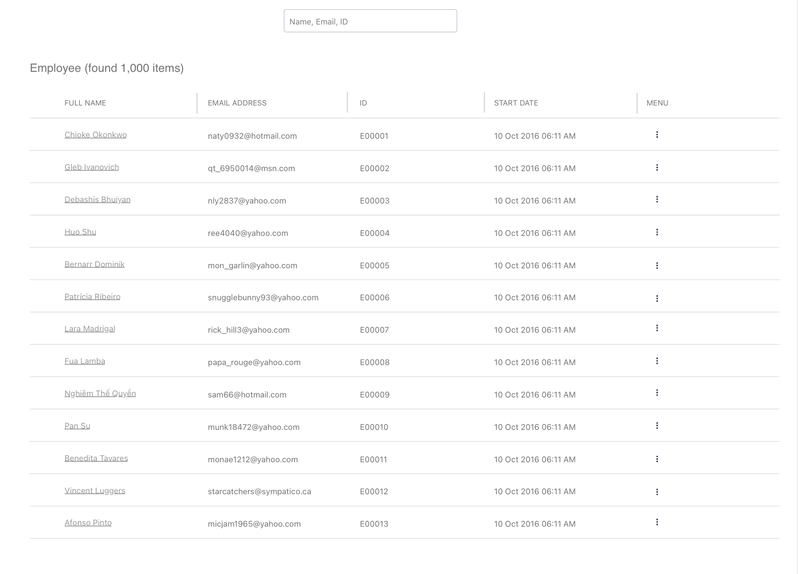

# Frontend Coding Assignment

UI Explanation: See [UI Design](./_assigment_doc_asset_/ui-design.md)

## 1. Assignment Context (Story)

### The Challenge
Your company has grown rapidly and now has multiple development teams working on different employee management tools. Each team has their own preferred technology stack - some love React, others swear by Svelte, and a few prefer to keep things simple with vanilla JavaScript.

The problem? Every team is building their own employee search and display components from scratch, leading to:
- Inconsistent user experiences across different applications
- Duplicated development effort and maintenance overhead
- Different data fetching strategies causing sync issues

### The Solution
You are tasked to build a **component library** for a reusable component system for an Employee Management app that will solve these problems once and for all.

The library will consist of 2 main components that serve specific purposes:
1. **Employee Search Input** - A user search input component
2. **Employee Table** - A component to display employee data

### Business Requirements from CTO:
1. **Multi-framework Support**: The library will be used by different teams across the organization:
   - Some teams use **React**
   - Some teams use **Svelte**
   - Some teams use only **vanilla JavaScript** to build their widgets

2. **External Data Source**: The library needs to fetch data from a 3rd party server (simulated by fetch `data.json` file), which means:
   - We cannot control the response format
   - We must work with whatever data structure is provided

3. **Real-time Data**: Real data may update frequently, so search results must always be up-to-date

4. **No Pagination**: The table will not need to have pagination - all data should be displayed in a single scrollable view

4. **Minimal UI & Small Library Size**: CTO wants the component UI to be very minimal, so the library should be small and UI framework may not be required

## 2. Core Requirements

**Important**: You must choose the best approach you think is suitable for Core Requirements. Consider factors like maintainability, performance, developer experience, and team adoption when making your architectural decisions.

### Employee Search Input Component
1. **Search Functionality**:
   - Placeholder text: "Name, Email, ID"
   - Can search across Name, Email, and ID fields
   - Trigger search when user types at least 2 characters
   - Show loading spinner while fetching data from `data.json`
   - Always fetch latest data when searching
   - UI must remain smooth and responsive while waiting for search results

### Employee Table Component
1. **Table Structure**:
   - Display total count: "Employee (found X items)" - always show total number of items
   - 5 columns: FULL NAME, EMAIL ADDRESS, ID, START DATE, MENU
   - Resizable columns (drag to resize column width)
   - Fixed table header (stays visible when scrolling)
   - Scrollable table body to view all rows

2. **Interactive Features**:
   - **Context Menu**: Click menu icon to open context menu with options:
     - "COPY NAME": Copy employee name to clipboard
     - "VIEW PROJECTS": Open popup/modal to view employee project details (you can design it as you want)
   - **Search Highlighting**: Highlight matched text in search results

## 3. Additional Requirements (Optional)

1. **Keyboard Shortcuts**:
   - Use `Ctrl+K` (Windows/Linux) or `Cmd+K` (Mac) to focus on the search input
   - Use arrow keys (Up/Down) to navigate and focus on table items
   - Use `Enter` key to open the context menu for the focused table item

## 4. Submission Guidelines

1. **GitHub Repository Structure**:
   - Create a GitHub repository with the following structure:
     - `/lib` - Contains your component library code
     - `/app` - Contains example application that demonstrates how to use your library

